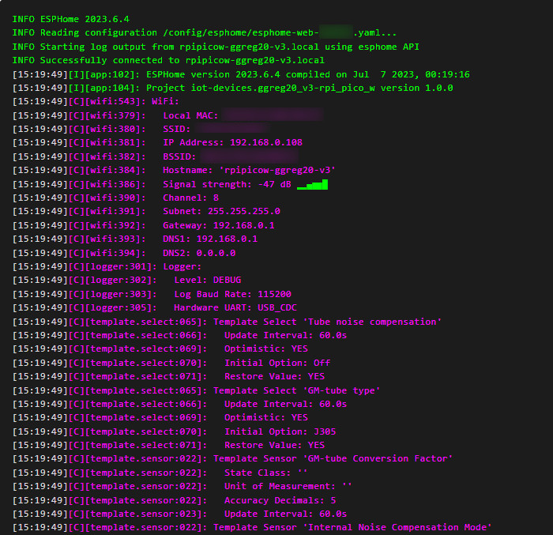
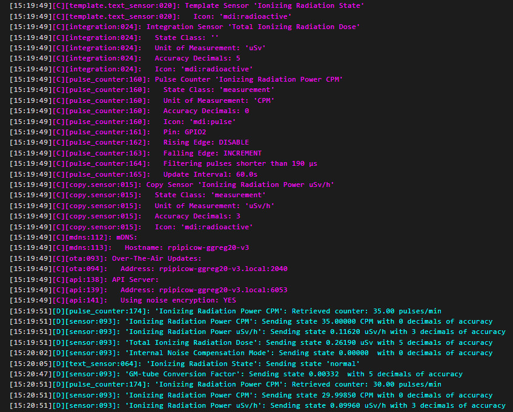
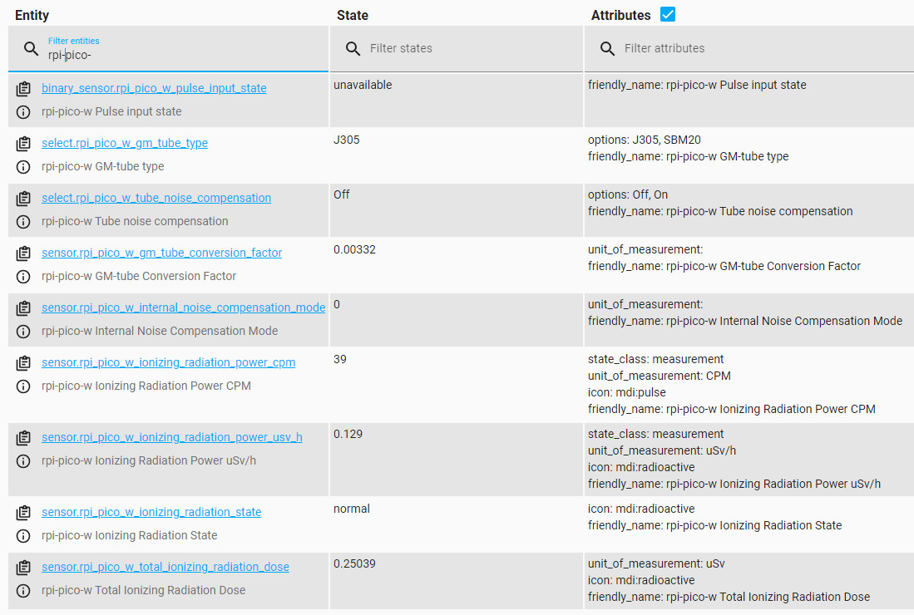
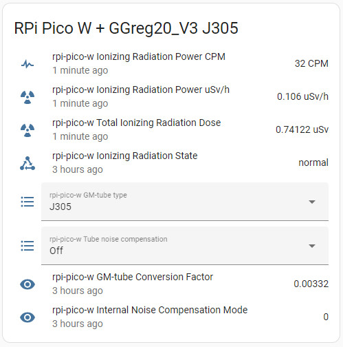
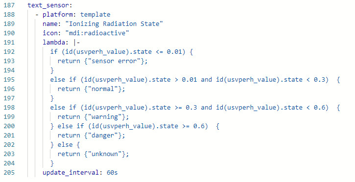
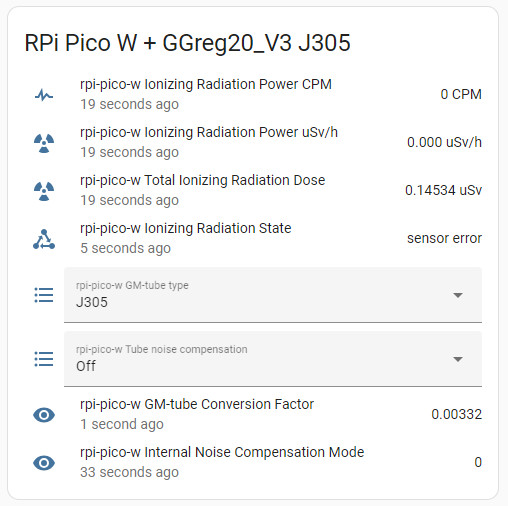

[](https://stand-with-ukraine.pp.ua)

# Raspberry Pi Pico W Geiger counter using GGreg20_V3 and ESPHome

## ESPHome and Home Assistant Compatibility
This hardware device is designed to be compatible with as many common software platforms and hardware systems as possible. GGreg20_V3 is compatible with any of the following systems: Arduino, ESP8266, ESP32, STM32, Raspberry Pi, ESPHome, Home Assistant, Tasmota, MicroPython, NodeMCU, Node-RED and many others. All you need to connect the GGreg20_V3 is a system with a pulse counter on the GPIO and a timer to measure time.


## Overview
### GGreg20_V3 with Raspberry Pi Pico W under Home Assistant with ESPHome firmware config example

We've been planning to post a GGreg20_V3 configuration example for the Raspberry Pi Pico W since [ESPHome started supporting this wonderful controller](https://esphome.io/changelog/2022.11.0.html) with wireless support. But after [users started making projects for RPi with GGreg20_V3](https://www.reddit.com/r/raspberry_pi/comments/14kw5ur/remote_wifi_radiation_monitor_using_rpi_pico_w/), and after [Tom's Hardware wrote about a project using Pico W](https://www.tomshardware.com/news/raspberry-pi-radiation-monitor-goes-wireless-with-pico-w), we also made our own full-featured configuration example.

The main features of this example configuration compared to our previous ones:
- two types of tubes are taken into account and supported: J305 and SBM20. The user can switch between the two types of tubes with a convenient selector to calculate the values directly during operation, via the frontend, for example, through the Home Assistant dashboard widget.
- the Geiger tube internal noise compensation mode was taken into account and offered. This mode can also be switched directly during operation via the frontend.
- the calculation of internal noise compensation also takes into account the situation when the number of pulses is not enough to compensate. In this case, no compensation is performed. Please note that our example contains the coefficients provided by Geiger tube manufacturers: for J305: 0.2 pulses per second; for SBM20: 1 pulse per second.
- the configuration creates a separate text sensor that automatically shows the current status according to the radiation level: normal / warning / danger.
- The text status sensor also supports the situation when no pulses are received from the GGreg20_V3 module. In this case, this sensor will have the text value sensor error.

Special thanks to our Friend, [Sboger](https://mastodon.social/@sboger)!
Without your [experiment](https://mastodon.social/@sboger/109510482022928362), we would not have purchased the RPi-Pico-W and made this example.

Team IoT-devices, LLC

## Easy Links <sup> for Radiation detection applications</sup>
1. Geiger counter GGreg20_V3 module
- [go.iot-devices.com.ua/geiger-counter](https://go.iot-devices.com.ua/geiger-counter)
  - [go.iot-devices.com.ua/ggreg20_v3](https://go.iot-devices.com.ua/ggreg20_v3)
  - [go.iot-devices.com.ua/ggreg20_v3_tindie](https://go.iot-devices.com.ua/ggreg20_v3_tindie)
2. Geiger counter emulator GCemu20_V1 module
- [go.iot-devices.com.ua/geiger-counter-emulator](https://go.iot-devices.com.ua/geiger-counter-emulator)
  - [go.iot-devices.com.ua/gcemu20_v1](https://go.iot-devices.com.ua/gcemu20_v1)
3. High voltage converter DCDC_3V3_400V_V1 module
- [go.iot-devices.com.ua/high-voltage-converter](https://go.iot-devices.com.ua/high-voltage-converter)
  - [go.iot-devices.com.ua/dcdc_3v3_400v_v1](https://go.iot-devices.com.ua/dcdc_3v3_400v_v1)


## Documentation
- Product description https://iot-devices.com.ua/en/product/ggreg20_v3-ionizing-radiation-detector-with-geiger-tube-sbm-20/
- Datasheet https://iot-devices.com.ua/wp-content/uploads/2021/11/ggreg20_v3-datasheet-eng.pdf
- RPi Pico W Pinout https://datasheets.raspberrypi.com/picow/PicoW-A4-Pinout.pdf
- ESPHome https://esphome.io/components/rp2040.html

## RPi Pico W Exapmle config code

We have developed such a file for Raspberry Pi Pico W with GGreg20_V3 and posted it here for free download and use by anyone who needs to connect GGreg20 to Home Assistant via ESPHome.
> The YAML file is a common text script file in Home Assistant (in this case dedicated to ESPHome) which is used as config when building the firmware.

Let's look on the main parts of the [rpipicow-ggreg20-v3.yaml](rpipicow-ggreg20-v3.yaml) file prepared by us:

### Calculating CPM and uSv/h
To calculate the value of the ionizing radiation power in CPM and in microsieverts per hour, we used Pulse Counter Sensor - an API-component of the ESPHome plug-in:
https://esphome.io/components/sensor/pulse_counter.html

This part of the yaml code is responsible for that:
```yaml
sensor:
  - platform: pulse_counter
    pin: GPIO2
    unit_of_measurement: 'CPM'
    name: 'Ionizing Radiation Power CPM'
    count_mode: 
      rising_edge: DISABLE
      falling_edge: INCREMENT # GGreg20_V3 uses Active-Low logic
    use_pcnt: False
    internal_filter: 190us
    update_interval: 60s
    accuracy_decimals: 0
    id: cpm_value
    filters:
    #  - offset: -12 # if J305 is used, it has background noise 0.2 pulses / sec x 60 sec = 12 CPM (Counts per minute)
      - lambda: "if (id(noise_comp) == 1 and id(conv_factor) == 0.00332 and x >=12 ) return x - 12; else return x;"
      - lambda: "if (id(noise_comp) == 1 and id(conv_factor) == 0.0057 and x >=60 ) return x - 60; else return x;"

  - platform: copy
    source_id: cpm_value
    name: 'Ionizing Radiation Power uSv/h'
    unit_of_measurement: 'uSv/h'
    accuracy_decimals: 3
    id: usvperh_value
    icon: "mdi:radioactive"
    filters:
# Uncomment this to get MA-5 values
#      - sliding_window_moving_average: # 5-minutes moving average (MA5) here
#          window_size: 5
#          send_every: 1      

      # 0.00332 - J305βγ glass GM tube (datasheet sensitivity at 60Co, 44 CPS per mR/h) conversion factor of pulses into uSv/Hour
      # 0.0057 - SBM20 GM tube conversion factor of pulses into uSv/Hour
      - lambda: return x * id(conv_factor);
```
### Calculating Total Dose, uSv

To calculate the total radiation dose received in microsieverts, the Integration Sensor, also a component of the ESPHome API, is used:
https://esphome.io/components/sensor/integration.htm

This part of the yaml code is responsible for that:
```yaml
  - platform: integration
    name: "Total Ionizing Radiation Dose"
    unit_of_measurement: "uSv"
    sensor: usvperh_value # link entity id to the values above
    icon: "mdi:radioactive"
    accuracy_decimals: 5
    time_unit: min # integrate values every next minute
    filters:
      # obtained dose. Converting from uSv/hour into uSv/minute: [uSv/h / 60] OR [uSv/h * 0.0166666667]. 
      # But if cpm_value is used in CPM (instead of usvperh_value), then for J305 [0.00332 / 60 minutes] = 0.00005533; so CPM * 0.00005533 = dose every next minute, uSv.
      - multiply: 0.0166666667
```
### Radiation level text state

We also made a text sensor that displays the current state of the radiation level and also indicates a sensor error if less than 3 pulses per minute are received from the GGreg20_V3 module.
The following ESPHome component is used to solve this task: https://esphome.io/components/text_sensor/index.html

This part of the yaml code is responsible for that:
```yaml
text_sensor:
  - platform: template
    name: "Ionizing Radiation State"
    icon: "mdi:radioactive"
    lambda: |-
      if (id(usvperh_value).state <= 0.01) {
        return {"sensor error"};
      } 
      else if (id(usvperh_value).state > 0.01 and id(usvperh_value).state < 0.3)  {
        return {"normal"};
      } 
      else if (id(usvperh_value).state >= 0.3 and id(usvperh_value).state < 0.6)  {
        return {"warning"};
      } else if (id(usvperh_value).state >= 0.6)  {
        return {"danger"};
      } else {
        return {"unknown"};
      }
    update_interval: 60s
```
### Aux components
And finally, we added several auxiliary components to ESPHome that allowed us to provide the user with the ability to select the type of tube (J305 / SBM20) and switch the mode of compensation for internal noise of the tubes without rewriting the code, i.e. runtime.
Global variables, selectors, and two additional sensors are responsible for this:
#### Globals
```yaml
globals:
  - id: conv_factor
    type: float
    restore_value: yes
    initial_value: "0.00332"
  - id: noise_comp
    type: int
    restore_value: yes
    initial_value: "0"
```
#### Runtime mode selectors
```yaml
select:
  - platform: template
    name: Tube noise compensation
    id: tube_noise_comp
    restore_value: yes
    options:
      - "Off"
      - "On"
    initial_option: "Off"
    optimistic: True
    on_value:
      then:
        - if:
            condition:
              lambda: 'return id(tube_noise_comp).state == "Off";'
            then:
              - lambda: "id(noise_comp) = 0;"
            else:
              lambda: "id(noise_comp) = 1;"
        - sensor.template.publish:
            id: noise_comp_sensor
            state: !lambda |-
              return id(noise_comp);
 
  - platform: template
    name: GM-tube type
    id: gm_tube_type
    restore_value: yes
    options:
      - "J305"
      - "SBM20"
    initial_option: "J305"
    optimistic: True
    on_value:
      then:
        - if:
            condition:
              lambda: 'return id(gm_tube_type).state == "J305";'
            then:
              lambda: "id(conv_factor) = 0.00332;"
            else:
              lambda: "id(conv_factor) = 0.0057;"
        - sensor.template.publish:
            id: gm_tube_convf_sensor
            state: !lambda |-
              return id(conv_factor);
```
#### Additional virtual sensors
```yaml
  - platform: template
    name: "GM-tube Conversion Factor"
    id: gm_tube_convf_sensor
    accuracy_decimals: 5
    lambda: |-
      return id(conv_factor);
    update_interval: 60s

  - platform: template
    name: "Internal Noise Compensation Mode"
    id: noise_comp_sensor
    accuracy_decimals: 0
    lambda: |-
      return id(noise_comp);
    update_interval: 60s
```

The ESPHome plugin has sufficient documentation for these components with examples, so we will not go into detailed explanations.
## Results of our work in Home Assistant
### RPi ESPHome Log screen

### RPi ESPHome Log screen (continued)

### RPi ESPHome Developer tools section entities list

### Home Assistant Dashboard wiget (state: normal)

### Source yaml config part dedicated to Text states  

### Home Assistant Dashboard wiget (state: sensor error)


## GGreg20_V3 examples for other platforms
[GGreg20_V3 Root repo](https://github.com/iotdevicesdev/DIY-Geiger-Counter-Module-GGreg20_V3)

## Additional resources
On Tindie: https://www.tindie.com/products/iotdev/ggreg20_v3-ionizing-radiation-detector/

IoT-devices Online Shop: https://iot-devices.com.ua/en/product/ggreg20_v3-ionizing-radiation-detector-with-geiger-tube-sbm-20/

<a href="https://www.youtube.com/watch?feature=player_embedded&v=lGIwdO35k1w" target="_blank">
 
</a><br>

IoT-devices YouTube Channel: 
https://www.youtube.com/channel/UCHpPOVVlbbdtYtvLUDt1NZw/videos
